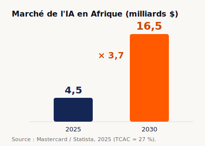
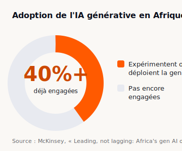
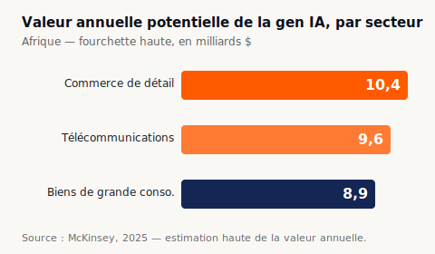

<!--
ARTICLE VALIDÉ SUR LE FOND — prêt pour mise en ligne.
Chiffres : tous sourcés et vérifiables (voir « Sources » en bas). Aucun prix affiché
(remplacé par un lien devis, choix éditorial validé).
Images : 3 graphiques de données dans public/insights/charts/ (SVG, données réelles,
couleurs OpenLab). À la publication : les uploader en Media (ou les rasteriser en
AVIF/PNG via sharp — les uploads SVG bruts sont évités pour raison de sécurité OWASP).
Saisie : admin Insights, ou seed (docs/admin-creer-un-article.md).
-->

# Métadonnées (pour la saisie admin)

- **slug** : `cabinet-ia-abidjan-comment-choisir`
- **title (SEO, ≤60)** : Cabinet IA à Abidjan : comment bien choisir
- **meta description (≤155)** : Comment choisir un cabinet IA à Abidjan ? Critères, pièges et questions à poser, par OpenLab Consulting. Le guide pour dirigeants ivoiriens.
- **catégorie** : `souverainete`
- **auteur** : Debora Ahouma
- **cover suggérée** : `public/insights/charts/marche-ia-afrique.svg` (ou un visuel hero dédié)
- **À retenir (summary, GEO §12.4)** :
  - Le marché de l'IA en Afrique passerait de 4,5 à 16,5 milliards $ entre 2025 et 2030 — et la Côte d'Ivoire s'est dotée d'une stratégie nationale dotée de plus de 1 000 milliards FCFA.
  - Un cabinet IA se choisit sur sa R&D, sa conformité locale et la souveraineté de son hébergement — pas sur une démo.
  - Six critères séparent un vrai cabinet d'une agence digitale qui sous-traite l'IA.

---

# Cabinet IA à Abidjan : comment bien choisir

L'intelligence artificielle attire toutes les promesses. Et tous les opportunistes. À Abidjan, le mot « IA » figure désormais sur la plaquette d'agences qui faisaient des sites vitrines il y a deux ans. Le risque n'est pas de manquer de prestataires. Le risque, c'est d'en choisir un mauvais.

Un projet IA raté coûte deux fois : le budget perdu, et le temps que vos équipes n'ont pas consacré à autre chose. Ce guide vous donne les critères pour trancher — avant le premier devis.

## Un marché qui décolle, une fenêtre qui se referme

Le sujet n'est plus théorique. Le marché de l'IA en Afrique est estimé à 4,5 milliards de dollars en 2025 et devrait atteindre 16,5 milliards en 2030, soit près de quatre fois plus en cinq ans.

À l'échelle du continent, McKinsey estime que l'IA générative pourrait créer entre 61 et 103 milliards de dollars de valeur par an. Et l'adoption a déjà commencé : plus de 40 % des organisations africaines expérimentent ou déploient l'IA générative.

La Côte d'Ivoire ne regarde pas passer le train. En 2024, le pays a adopté sa Stratégie Nationale de l'Intelligence Artificielle à horizon 2030, élaborée avec l'appui de la Banque mondiale, avec un plan d'investissement de plus de 1 000 milliards FCFA sur 2025-2030 et la création d'une Agence Nationale de l'IA. Autrement dit : la question n'est plus « faut-il s'y mettre », mais « avec qui ».

## Pourquoi le choix du cabinet décide du résultat

Une IA n'est pas un logiciel qu'on installe. C'est un système qui apprend de vos données, s'intègre à vos processus, et doit rester conforme au droit ivoirien. Le prestataire ne livre pas un produit fini : il livre une capacité durable, ou un prototype qui meurt après la facture.

La différence se joue rarement sur la technologie. Elle se joue sur la méthode, la légitimité et ce qui reste quand le consultant est parti.

## Les 6 critères qui séparent un vrai cabinet IA d'une agence digitale

**1. R&D propre, pas simple revente.** Ce cabinet construit-il, ou revend-il ? Un intégrateur qui se contente de brancher une API étrangère n'a aucune maîtrise quand le besoin sort du cadre standard. Demandez à voir les produits : OpenLab Consulting exploite huit logiciels propriétaires, de la paie conforme CNPS à la surveillance structurelle des bâtiments. La R&D est détaillée sur la page [Laboratoire](/laboratoire), l'approche conseil sur [Conseil & stratégie IA](/expertises/conseil-strategie).

**2. Conformité locale réellement maîtrisée.** Une IA RH qui ignore les taux CNPS, ITS et FDFP produit des fichiers faux. Un ERP qui ne parle pas SYSCOHADA n'est pas déployable en zone OHADA. Et toute donnée personnelle relève de la loi ivoirienne 2013-450 — et du RGPD dès qu'un client européen est concerné.

**3. Souveraineté de l'hébergement.** Où vivent vos données et vos modèles ? « Sur un cloud américain, quelque part » signifie perte de contrôle, et parfois de conformité. Demandez le schéma de déploiement.

**4. Des preuves, pas des superlatifs.** « Révolutionnaire » ne vaut rien sans chiffre sourcé et daté. Un bon cabinet montre des cas réels et reconnaît les limites de son approche.

**5. Transfert de compétences.** Le meilleur cabinet vous rend autonome. Si tout repose sur sa présence permanente, vous n'avez pas acheté une capacité, vous avez loué une dépendance.

**6. Légitimité et durée.** Références vérifiables, équipe à visage découvert (page [équipe](/a-propos/equipe)), ancienneté.

## Où l'IA crée le plus de valeur

Tous les secteurs ne sont pas logés à la même enseigne. Le commerce de détail, les télécommunications et les biens de grande consommation concentrent l'essentiel du potentiel de valeur de l'IA générative sur le continent.

Un bon cabinet sait où l'IA paie vite chez vous — et où elle ne paiera pas. C'est tout l'objet d'un cadrage sérieux.

## Les questions à poser au premier rendez-vous

- Quels logiciels avez-vous développés vous-mêmes, et lesquels sont en production ?
- Où seront hébergées nos données, et sous quelle juridiction ?
- Comment gérez-vous la conformité CNPS / SYSCOHADA / loi 2013-450 ?
- Que reste-t-il à mes équipes une fois la mission terminée ?
- Pouvez-vous me montrer un cas chiffré et sourcé ?

Les réponses floues sont une réponse en soi.

## Les signaux d'alerte

Méfiez-vous des promesses chiffrées sans source, des « démos » qui sont en réalité des vidéos montées, et de la sous-traitance offshore non assumée — votre projet, et vos données, partent alors là où vous ne les suivez plus. Méfiez-vous aussi du cabinet qui dit oui à tout : un partenaire honnête sait dire « ceci n'est pas un bon cas d'usage pour l'IA ».

## Conseil + R&D + édition : le triple avantage local

La plupart des acteurs font une seule de ces trois choses. Très peu les réunissent : conseiller, construire ses propres produits, et publier.

OpenLab Consulting tient les trois. Le conseil cadre et déploie. La R&D produit huit logiciels propriétaires. Et l'édition — avec le livre [« Intelligence Artificielle : du Machine Learning aux Agents Autonomes »](/livre) — ancre une exigence académique. Ce n'est pas un argument de vente : c'est ce qui garantit qu'un conseil est adossé à une pratique réelle, pas à une présentation.

## Combien ça coûte : pourquoi nous n'affichons pas de tarif

Un projet IA n'a pas de prix de catalogue. Tout dépend de votre périmètre, de l'état de vos données, du niveau de conformité requis et de l'ambition visée. Afficher une grille tarifaire serait malhonnête — et le signe d'un prestataire qui vend un produit standard, pas une réponse à votre situation.

Notre approche : un diagnostic d'abord, un devis ensuite, adossé à un périmètre clair. Commencez par un [audit IA gratuit](/audit-ia) ; nous chiffrons ensuite sur la base d'un cadrage précis. [Contactez-nous](/contact) pour un devis.

## Conclusion

Un cabinet IA ne se juge pas à son vocabulaire. Il se juge à ce qu'il construit, à sa maîtrise du droit local, et à ce qu'il vous laisse une fois parti. Posez les bonnes questions. Exigez des preuves. Et commencez petit, par un diagnostic.

**Réservez votre [audit IA gratuit](/audit-ia)** : cinq questions, une recommandation adaptée, un consultant senior pour en parler.

---

## Sources (vérifiables)

1. McKinsey, « Leading, not lagging: Africa's gen AI opportunity », mai 2025 — 61 à 103 Md$ de valeur annuelle potentielle ; plus de 40 % des organisations africaines déjà engagées ; valeur par secteur. https://www.mckinsey.com/capabilities/quantumblack/our-insights/leading-not-lagging-africas-gen-ai-opportunity
2. Mastercard / Statista, 2025 — marché IA Afrique 4,5 Md$ (2025) → 16,5 Md$ (2030). https://www.mastercard.com/news/eemea/en/newsroom/press-releases/en/2025-1/august/ai-in-africa-to-top-16-5b-by-2030-mastercard-explores-path-for-continued-digital-transformation/ · https://www.statista.com/outlook/tmo/artificial-intelligence/africa
3. République de Côte d'Ivoire, Stratégie Nationale de l'IA à l'horizon 2030 (Ministère de la Transition Numérique et de la Digitalisation, appui Banque mondiale), 2024 — plan > 1 000 milliards FCFA 2025-2030, création de l'ANIA. https://telecom.gouv.ci/new/uploads/publications/174196670372.pdf

## Liens internes posés (routes existantes)

- /laboratoire · /expertises/conseil-strategie · /a-propos/equipe · /livre · /audit-ia · /contact

## Graphiques (données réelles, générés — public/insights/charts/)

- `marche-ia-afrique.svg` — barres 2025 vs 2030 (Mastercard/Statista)
- `adoption-gen-ia-afrique.svg` — donut 40 %+ d'adoption (McKinsey)
- `valeur-gen-ia-secteurs.svg` — barres par secteur (McKinsey)
